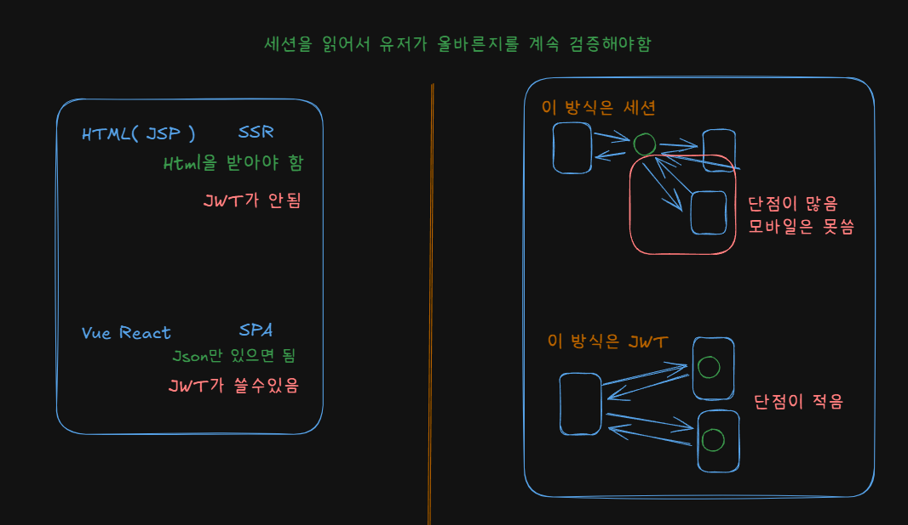

### 아키텍쳐


### Django 프로젝트 생성 후 서버 동작
```
django-admin startproject mysite .
python manage.py runserver // default port: 8000
```

### 어플리케이션 (미니 테스트) 생성
```
python manage.py startapp minitest
```

### 미니 테스트 API
- minitest/views.py: 비즈니스 로직
- minitest/repositories.py: 데이터 접근 로직
- minitest/models.py: 데이터 모델 (데이터베이스 활용할 경우, 효과 극대화)
- minitest/tmp_database.py: 임시 데이터베이스

### 미니 테스트 API 동작 캡쳐
- POST


- GET


### MongoDB 
- Django는 내장된 마이그레이션 시스템을 사용하여 초기화
```
# 모델 변경사항을 마이그레이션 파일로 생성
python manage.py makemigrations

# 마이그레이션 적용하여 데이터베이스 스키마 변경
python manage.py migrate
```

'monosh' 명령어로 몽고 쉘 접속 가능
```
test> show dbs
BBApiMiniTest       676.00 KiB
admin                40.00 KiB
config              108.00 KiB
local                72.00 KiB
your_database_name  476.00 KiB
test> use BBApiMiniTest
switched to db BBApiMiniTest
BBApiMiniTest> db.users.find()
[
  {
    _id: ObjectId('6831873ca8646fb356b6a0d9'),
    id: Binary.createFromBase64('xu5reTvwQDu2JLMY66yeYQ==', 3),
    email: 'test1@test.com',
    password: '$2b$12$9G7P.hPep75Q7YHRZ44Dk.MFvhaBsnB5ukymsTOy/XZ.7zKVUFqsO',
    name: 'test1_change',
    role: 'worker',
    created_at: ISODate('2025-05-24T08:45:48.865Z'),
    updated_at: ISODate('2025-05-24T11:52:47.440Z')
  },
  {
    _id: ObjectId('6831c234af2d6020fd2fa5cc'),
    id: Binary.createFromBase64('R/+lHYpyR4Wi/J/ajgnxcA==', 3),
    email: 'test2@test.com',
    password: '$2b$12$ttmsK7V0EHx/ZZ3RJqgyT.DFfW5WZrRGR8FrC8U46jt19O1dKv9Im',
    name: 'test2',
    role: 'boss',
    created_at: ISODate('2025-05-24T12:57:24.802Z'),
    updated_at: ISODate('2025-05-24T12:57:24.802Z')
  }
]
```
