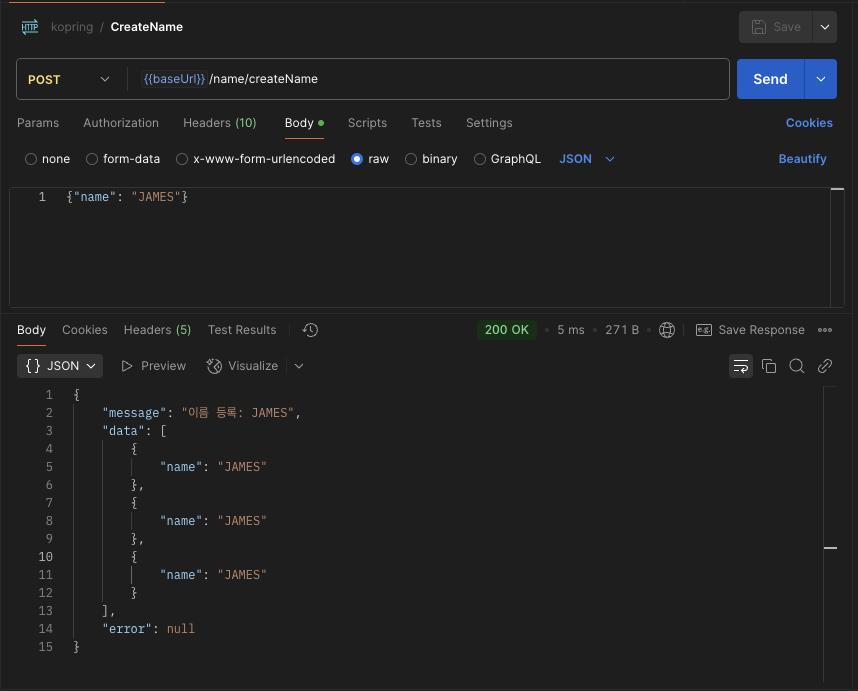
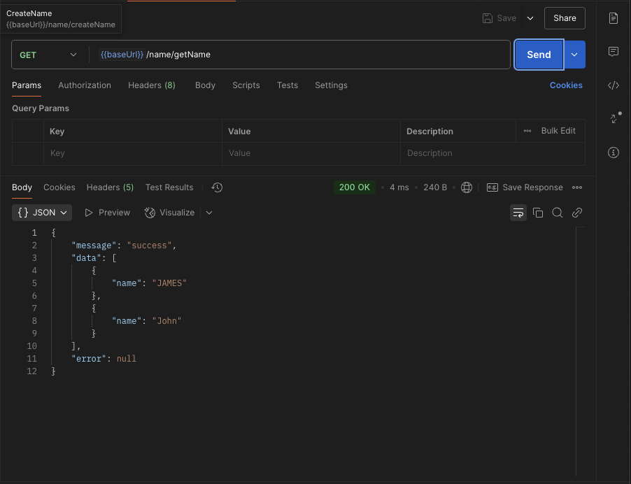
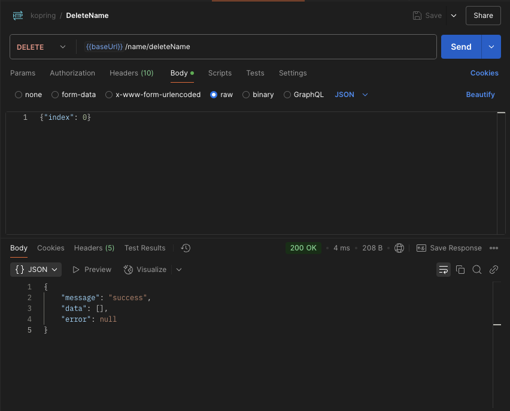

## Kotlin-Spring 구동 역할
1. Application: 스프링 부트 애플리케이션 구동
2. Controller: Http 요청을 받고 repository 호출을 수행한 뒤 결과를 응답으로 반환
3. Repository: 저장소 역할을 수행(현재 DB가 없음, 메모리 저장소) 호출대로 저장 조회 삭제 수행

## curl 테스트

### 생성

### 조회

### 삭제
