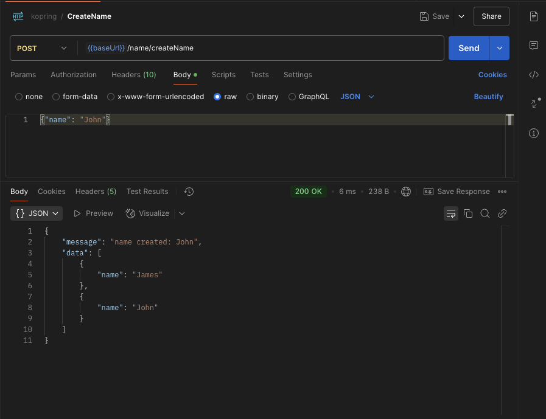
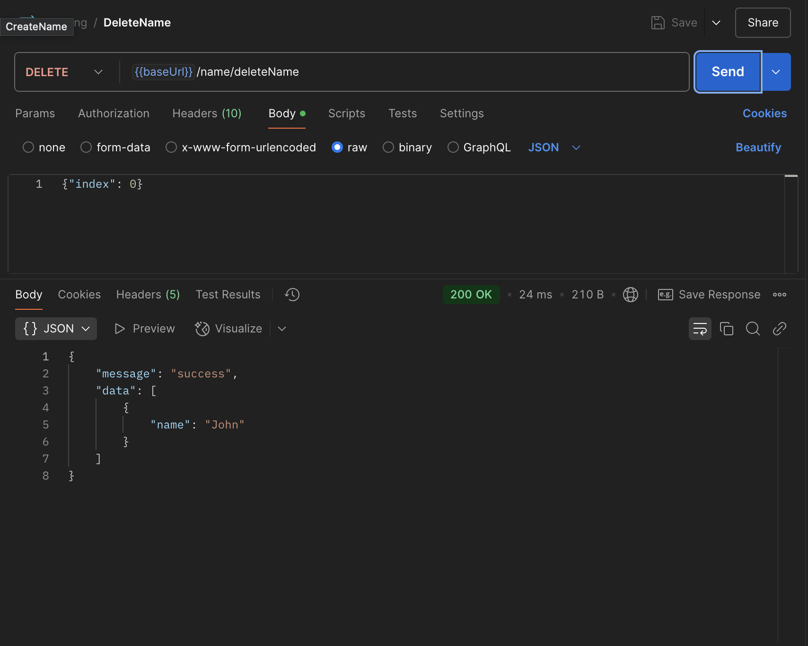
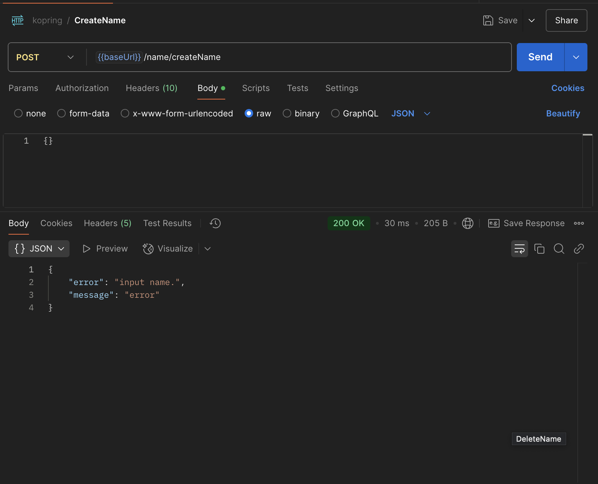
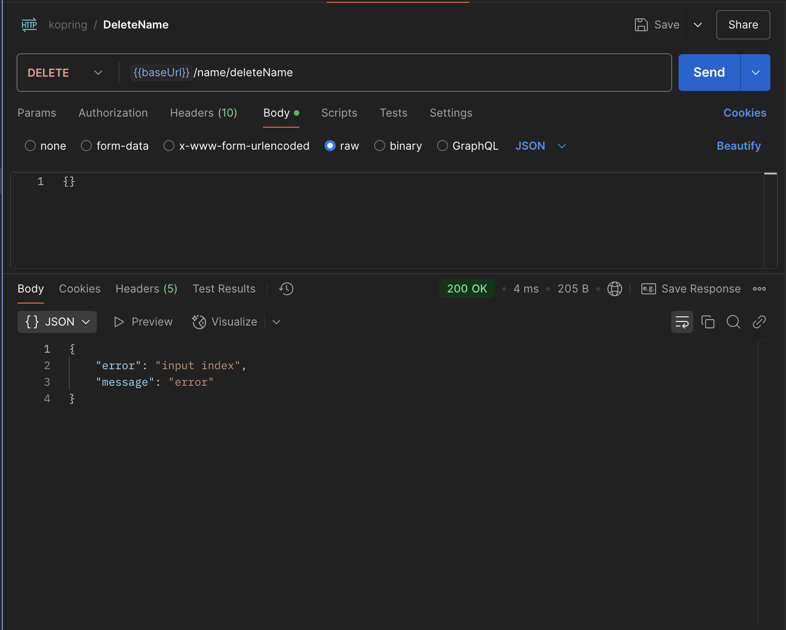
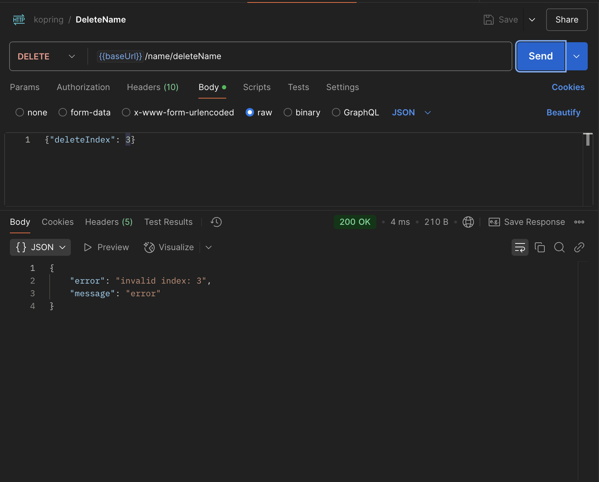

## Kotlin-Spring 구동 역할
1. Application: 스프링 부트 애플리케이션 구동
2. Controller: Http 요청을 받고 repository 호출을 수행한 뒤 결과를 응답으로 반환
3. Repository: 저장소 역할을 수행(현재 DB가 없음, 메모리 저장소) 호출대로 저장 조회 삭제 수행

## curl 테스트

## 성공
### 생성

### 조회

### 삭제

## 실패
### 생성 - 이름 Null

### 생성 - 중복 이름 오류

### 삭제 - 인덱스가 없는 경우

### 삭제 - 유효하지 않은 인덱스

