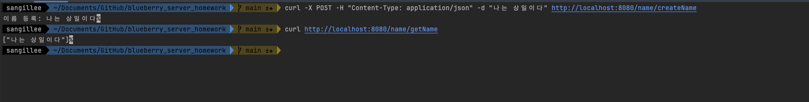

## Kotlin-Spring 구동 역할
1. Application: 스프링 부트 애플리케이션 구동
2. Controller: Http 요청을 받고 repository 호출을 수행한 뒤 결과를 응답으로 반환
3. Repository: 저장소 역할을 수행(현재 DB가 없음, 현재 메모리 저장소) 호출대로 저장 조회 수행

## curl 테스트

#### 생성
- curl -X POST -H "Content-Type: application/json" -d "이름" http://localhost:8080/name/createName
#### 조회
- curl http://localhost:8080/name/getName

