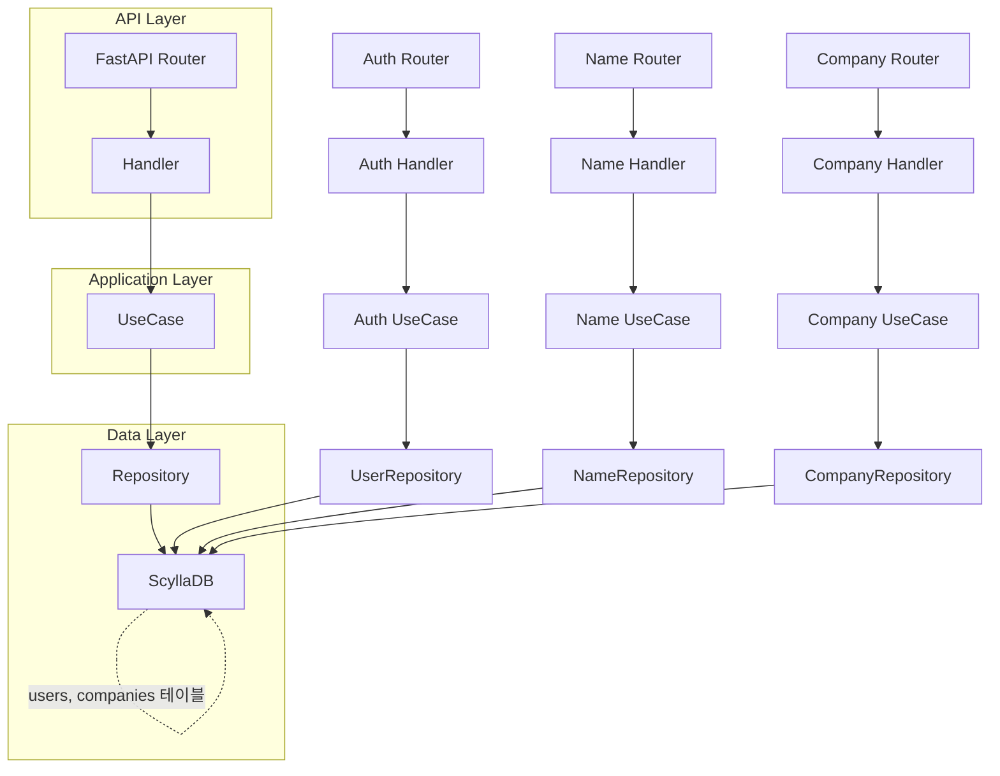

# 프로젝트 아키텍처 플로우차트

---

- **API Layer**: FastAPI 라우터와 핸들러가 요청을 받아 처리합니다.
- **Application Layer**: UseCase에서 비즈니스 로직을 담당합니다.
- **Data Layer**: Repository가 ScyllaDB와 직접 통신합니다.
- 인증, 이름, 회사 등 모든 주요 기능이 동일한 계층 구조를 따릅니다.
- DB에는 users, companies 등 실제 테이블이 존재합니다. 