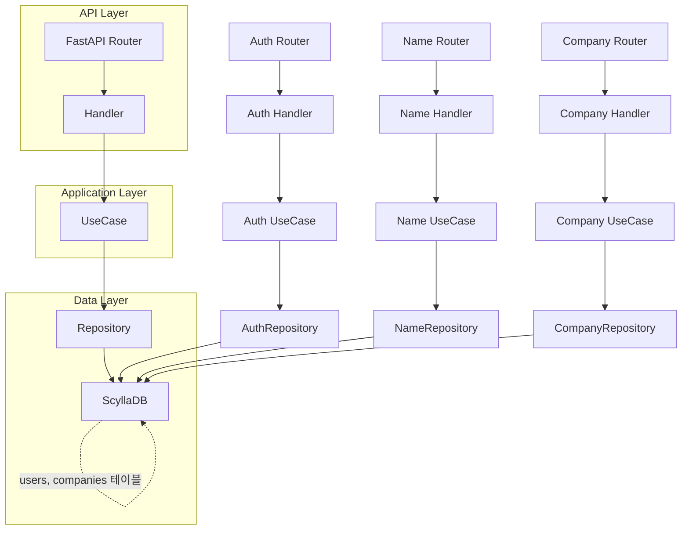

# 서비스 아키텍처 플로우차트 및 설명



---

## 전체 서비스 흐름 및 계층별 역할

- **API Layer**
    - FastAPI Router: HTTP 엔드포인트 정의, Swagger 문서 자동 생성
    - Handler: 요청/응답 전처리, 예외 처리, 유스케이스 호출
- **Application Layer**
    - UseCase: 비즈니스 로직 담당, 권한 체크, 데이터 가공 등
- **Data Layer**
    - Repository: DB 쿼리 및 데이터 CRUD, ScyllaDB와 직접 통신
    - ScyllaDB: 실제 데이터 저장소(users, companies 등 테이블)

### 주요 흐름 예시
- 회원가입/로그인/유저정보: Auth Router → Auth Handler → Auth UseCase → AuthRepository → users 테이블
- 회사 생성/조회/수정/삭제: Company Router → Company Handler → Company UseCase → CompanyRepository → companies 테이블
- 이름 관리: Name Router → Name Handler → Name UseCase → NameRepository → users 테이블

---

## Swagger 문서 상세화

- **DTO(Pydantic 모델) 사용**: request/response 모델을 명확히 지정하면 Swagger에서 자동으로 필드 설명, 타입, 예시가 표시됩니다.
- **response_model 파라미터**: 각 라우터에 response_model을 지정하면 응답 구조가 Swagger에 명확히 나타납니다.
- **Field(..., description="설명", example="예시")**: DTO 필드에 description, example 옵션을 추가하면 Swagger에서 더 상세하게 표시됩니다.
- **한글 주석**: DTO, 라우터, 핸들러, 유스케이스, 레포지토리 등 주요 코드에 한글 주석을 달면 Swagger와 코드 모두에서 이해가 쉬워집니다.

### 예시 (DTO 필드 상세화)
```python
from pydantic import BaseModel, Field

class SignUpReqDTO(BaseModel):
    name: str = Field(..., description="사용자 이름", example="홍길동")
    email: str = Field(..., description="이메일", example="test@example.com")
    password: str = Field(..., description="비밀번호", example="1234abcd!")
    address: str = Field("", description="주소", example="서울시 강남구")
    role: str = Field("worker", description="역할(boss/worker)", example="boss")
```

---
